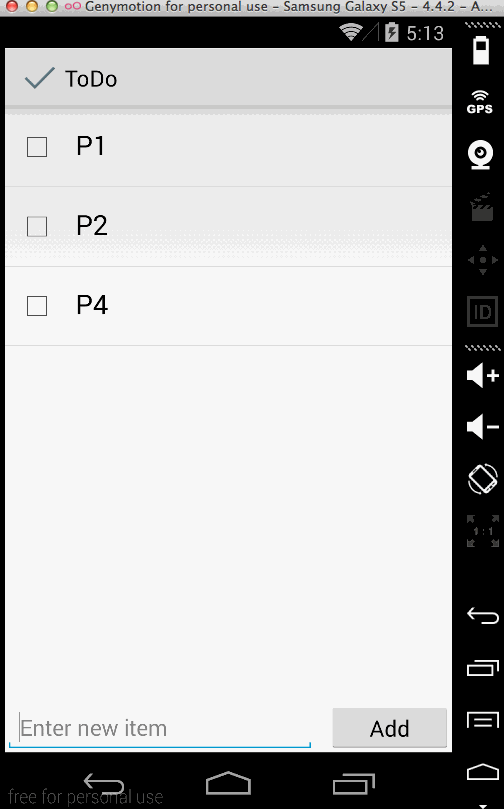

# Todo App for Android

Example of a Todo list app for Android

## Features
- Ability to edit todo items
- Completion due dates
- Item descriptions
- Item priorities
- Custom ListView
- Persistent storage with SQLite

## TODO
The following features are planned to be added:
- Better style for items in the list view
- Better general app style
- Use DialogFragment instead of a new Activity when editing items
- Item rearrangement

Check the full list of [enhancements/issues here](https://github.com/marcferna/android-todo/issues)

